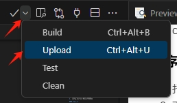

# RemoteIO-一个简单的远程IO板


### 更新日志
* 2024.05.01：
  * 固件版本升级到40501。
  * 解决了硬件AI输入问题。
  * 增AI输入部分的程序,将AI输入的4个通道值写入到地址15/16/17/18。
  * 增加两个寄存器，地址13/14，可用于扩展输入和输出。
#### 简介
一个基于STM32F103C8T6单片机的远程IO板，有8路DI，6路DO，4路AI，具备RS485、以太网、TTL串口接口，支持ModbusRTU和ModbusTCP协议，可用于上位机通信、远程控制等场景。

#### 概述
* 基于STM32F103C8T6单片机
* 输入：8路全隔离数字输入
  * 8路DI：DC24V,兼容NPN/PNP输入
  * 输入带滤波算法，默认5ms
* 输出：6路全隔离
  * 2路NPN输出
  * 4路继电器输出
  * 输出供电DC24V
* 拟输入输入：4路，16位ADC，输入电压范围0-5V。
* 通信端口：RS485x1，以太网x1，TTL串口x1
  * RS485:支持ModbusRTU协议
  * 以太网：支持ModbusTCP协议
  * TTL串口：用于下载程序或打印信息
* 供电接口：DC24V，支持9-24V输入
* 开发环境：PlatfromIO
* 开发框架：Arduino
* 软件架构：FreeRTOS，具备看门狗功能。


#### 程序流程

1.  串口重定向，因为在Arduino_STM32中，默认Serial是指向Serial2的，所以需要重定向到Serial。
2.  显示系统信息。(在myShowMsg.h中，#define UseSerialPrint用于打印信息，默认关闭。)
3.  加载相关参数。
4.  GPIO初始化。
5.  ModbusRTU协议初始化。
6.  ModbusTCP协议初始化。
7.  创建所有应用任务。
    1. WatchdogTask:看门狗任务，用于监控系统是否正常运行。
    2. X_filter：输入滤波任务，默认5ms。
    3. ModbusRTUTask：处理ModbusRTU协议任务。
    4. ModbusTCPTask：处理ModbusTCP协议任务。
    5. MainTask：主任务，处理输入输出处理。
8.  启动任务调度器。

#### 程序主要文件

1.  Parameter_Config.h：参数配置文件。
2.  IO_Setting.h：IO设置文件。
3.  myModbus.h：Modbus相关函数。
4.  myShowMsg.h：用于打印、显示信息。
5.  myTask.h：任务相关函数。
6.  main.cpp：程序入口文件。


#### 程序使用

1.  打开PlatfromIO，编译程序。
   
2.  下载程序到开发板。
    1.  如果使用stlink下载程序,需要一个stlink下载器，某宝上一个十来块钱的就能买到，下载时可以不用切换下载模式，非常方便，配置文件中设置的默认下载方式是stlink,所以不需要额外设置。
        ```C++
        # 程序上传选项，通过stlink和串口二选一
        #stlink上传选项
        upload_protocol = stlink

        # 串口上传选项
        #upload_port = COM13
        #upload_protocol = serial
        #upload_speed = 115200
        ```
    2.  使用串口下载程序，需要在PlatfromIO的设置中设置将下面两项开启，并注释掉stlink下载方式，注意下载时需要设置boot0引脚为1，再按复位键或者重新上电。
_注意：在下载程序后记得将boot0引脚复位为0，否则重新上电时程序不会冲flash启动。_
        ```C++
        # 程序上传选项，通过stlink和串口二选一
        #stlink上传选项
        #upload_protocol = stlink

        # 串口上传选项
        upload_port = COM13
        upload_protocol = serial
        upload_speed = 115200     
        ```
1.  打开串口助手，查看相关信息。
2.  连接输入输出端口，查看输入状态指示灯。
3.  ModbusRTU客户端软件，连接开发板,端口号和波特率由拨码开关决定，拨码开关全部为0时，波特率为115200，站号为1。
4.  ModbusTCP客户端软件，连接开发板，默认IP地址为192.168.1.168。
5.  我使用的Modbus软件。
    >链接：https://pan.baidu.com/s/1gVSAOsch675w53tLc9f6kw?pwd=um7m 
    >提取码：um7m 
    >复制这段内容后打开百度网盘手机App，操作更方便哦

#### Modbus寄存器说明

| Modbus地址 | 参数定义        | 默认值 | 单位 | 范围    | 读写 | 说明                                                                                                                                                                                                                                     |
| ---------- | --------------- | ------ | ---- | ------- | ---- | ---------------------------------------------------------------------------------------------------------------------------------------------------------------------------------------------------------------------------------------- |
| 0          | 固件版本号      | 40408  | /    |         | R    | 固件版本号,一位年尾号+2位月份+2位日                                                                                                                                                                                                      |
| 1          | 当前站号        |        | /    |         | R    | "全off为1，其他按位组合，修改后需重启生效<br>DIP3 DIP2 DIP1<br>000：1<br>001：1<br>010：2<br>依次类推,最大为111：7"                                                                                                                      |
| 2          | 当前波特率      | bps    | R    |         |      | "全off位115200，，修改后需重启生效<br>DIP5 DIP4<br>00：115200<br>01：9600<br>10：19200<br>11：38400"                                                                                                                                     |
| 3          | 参数保存        | 0      | /    |         | R/W  | "写入对应数值后，程序会自动清零<br>Save = 10,          // 将Modbus寄存器的值保存到EEPROM中<br>Reload = 20,        // 从EEPROM中加载Modbus寄存器的值<br>Reboot = 30,        // 重启设备<br>Factory_Reset = 66, // 恢复出厂设置并重启设备" |
| 4          | 输入滤波时间    | 5      | ms   | 1-100   | R/W  | 输入端口的滤波时间                                                                                                                                                                                                                       |
| 5          | MAC地址字节1和2 | 0XCDAB | /    |         | R/W  | 初始化时是以单片机ID自动生成                                                                                                                                                                                                             |
| 6          | MAC地址字节3和4 | 0X12EF | /    |         | R/W  |                                                                                                                                                                                                                                          |
| 7          | MAC地址字节5和6 | 0X5634 | /    |         | R/W  |                                                                                                                                                                                                                                          |
| 8          | IP地址低16位    | 0X01A8 | /    |         | R/W  | "例如：192.168.1.168，修改IP地址后必须重启才会生效。<br>15：高字节01=1，低字节A8=168<br>16：高字节C0=192，低字节A8=168"                                                                                                                  |
| 9          | IP地址高16位    | 0XC0A8 | /    |         | R/W  |                                                                                                                                                                                                                                          |
| 10         | 设备运行时间    |        | 秒   | 0-65535 | R    | 设备运行时间，重复0-65535，可用于心跳检测                                                                                                                                                                                                |
| 11         | 输入状态反馈    |        |      |         | R    | bit0-bit7分别对应X0-X7                                                                                                                                                                                                                   |
| 12         | 输出状态反馈    |        |      |         | R/W  | bit0-bit5分别对应Y0-Y5                                                                                                                                                                                                                   |
| 13         | 扩展输入状态反馈    |        |      |         | R | bit0-bit7分别对应X10-X17 bit8-bit15分别对应X20-X27                                                                                                                                                                                                                   |
| 14         | 扩展输出状态反馈    |        |      |         | R/W | bit0-bit7分别对应Y10-Y17 bit8-bit15分别对应Y20-Y27                                                                                                                                                                                                                   |
| 15         | AI0模拟量电压输入值    |        |      |         | R | AI0的模拟量电压输入转换的数字量，电压输入范围0-5V，精度0.01V,数字量经过转换公式（测量值\*0.0001818）后得到时实际输入电压值。例如数字值为27415，则输入电压为27415*0.0001818=4.98V。   注：如果读取值为32767，则表似乎模拟输入芯片部分未初始化完成，存在故障。                                                                                                                                                                                                                   |
| 16         | AI1模拟量电压输入值    |        |      |         | R | 参考AI0计算                                                                                                                                                                                                                   |
| 17         | AI2模拟量电压输入值    |        |      |         | R | 参考AI0计算                                                                                                                                                                                                                   |
| 18         | AI3模拟量电压输入值    |        |      |         | R | 参考AI0计算                                                                                                                                                                                                                   |

#### 其他说明

1.  程序使用下面三个库。
```
stm32duino/STM32duino FreeRTOS@^10.3.2
epsilonrt/Modbus-Ethernet@^1.0.3
epsilonrt/Modbus-Serial@^2.0.5
```
1.  为了使ModbusRTU和ModbusTCP共用数据区，所以需要将两个协议的数据指针指向相同的数据区，所以需要将Modbus类中的链表变量由私有变量更改为公共变量（默认已修改）。

```c++
//更改前
private:
TRegister *_regs_head;
TRegisterTRegister *_regs_last;

//更改后
public:
TRegister *_regs_head;
TRegisterTRegister *_regs_last;
```

####  引用
1.  [通过代码配置PlatformIO生成HEX文件。](https://blog.csdn.net/chang_jiang123/article/details/106215699)

#### 注意事项
1.  程序供学习参考，若用于商业用途，请自行承担因使用本程序而产生的风险。
2.  感谢您的关注！ 
